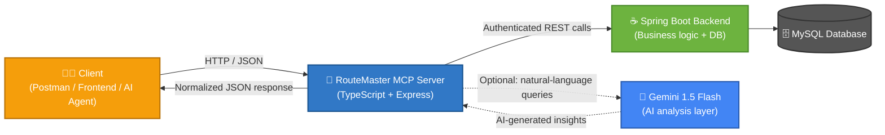
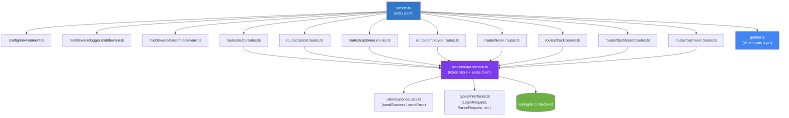
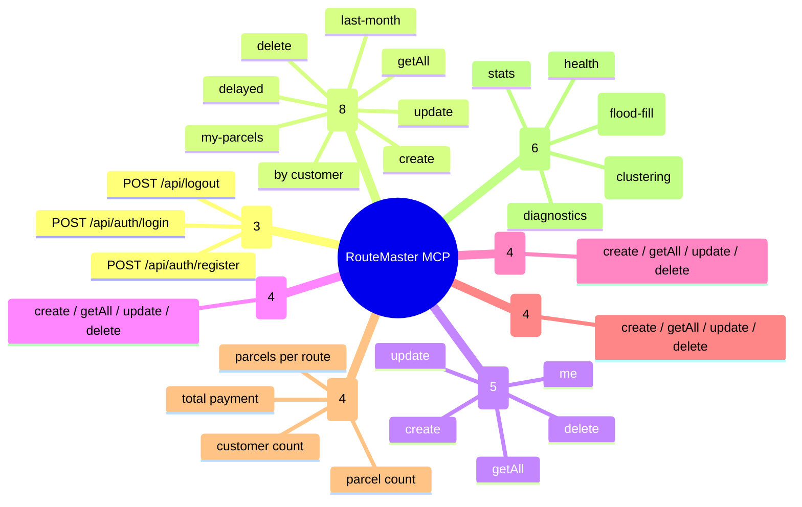
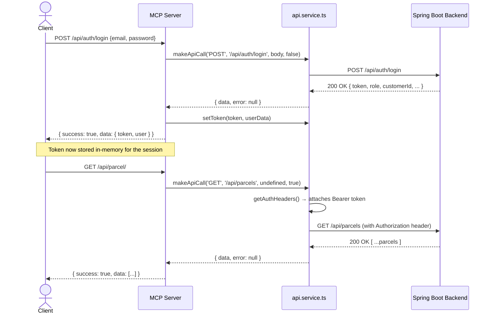

<div align="center">

# 🚚 RouteMaster MCP Server

### A TypeScript middleware layer that turns a Spring Boot logistics backend into a clean, modular, AI-aware API

[](https://nodejs.org/)
[](https://www.typescriptlang.org/)
[](https://expressjs.com/)
[](https://ai.google.dev/)
[](#)

**38 endpoints · 8 domains · 1 unified gateway**

</div>

---

## 📖 What is this?

**RouteMaster MCP Server** is a middleware control plane — an **MCP (Middleware Control Plane)** — built in TypeScript that sits between any client (Postman, a frontend, an AI agent) and the **[RouteMaster](#-related-project-routemaster-backend) Spring Boot logistics backend**.

Instead of every client having to know how the Spring Boot backend is structured, this server gives you **one clean, modular, predictable API** that:

- 🔐 Handles auth and token management for you
- 📦 Wraps every parcel / customer / employee / route / tracking operation
- 📊 Exposes dashboard analytics in a single call
- ⚡ Triggers route optimization algorithms (flood-fill & clustering) on the backend
- 🤖 Adds a **Gemini AI layer** that can reason over the data and answer natural-language questions about it

Think of it as a **typed, organized front door** to a logistics system — built the way a production API gateway would be, not a quick script.

---

## 🧠 Why this exists

The original prototype (`server.js`, included in this repo for history) was a single 280-line file with everything bolted together — no types, no structure, no separation of concerns.

The TypeScript rewrite (`routemaster-mcp-ts/`) is the real project: it takes that same idea and rebuilds it with **actual software architecture** —

| Before (`server.js`) | After (`routemaster-mcp-ts/`) |
|---|---|
| Plain JavaScript | TypeScript with full interfaces |
| One giant file | Routes, services, middleware, config — separated |
| Manual token juggling per-route | Centralized `api.service.ts` token store |
| No error contract | Consistent `sendSuccess` / `sendError` envelope |
| No AI layer | Gemini-powered analysis on top of live data |

This evolution is itself a signal of engineering maturity — going from "it works" to "it's structured to scale."

---

## 🏗️ Architecture

### High-level flow



**ASCII fallback** (if Mermaid doesn't render):

```
┌─────────────────────┐       ┌──────────────────────────┐       ┌────────────────────┐
│       CLIENT        │──────▶│   ROUTEMASTER MCP SERVER  │──────▶│  SPRING BOOT API   │
│ Postman / Frontend / │       │   (TypeScript + Express)  │       │  (business logic)  │
│      AI Agent        │◀──────│   :3000                   │◀──────│      :8081         │
└─────────────────────┘       └────────────┬─────────────┘       └─────────┬──────────┘
                                            │                                │
                                            ▼                                ▼
                                ┌──────────────────────┐          ┌────────────────────┐
                                │   GEMINI 1.5 FLASH    │          │   MYSQL DATABASE   │
                                │  (AI analysis layer)  │          │                    │
                                └──────────────────────┘          └────────────────────┘
```

### Internal module structure



---

## 📂 Project structure

```
MCP-main/
├── server.js                      # Original JS prototype (kept for history)
└── routemaster-mcp-ts/             # ⭐ The actual project
    ├── src/
    │   ├── server.ts               # App entry point, route mounting, startup banner
    │   ├── gemini.ts               # Gemini AI integration (callGemini, analyzeWithGemini)
    │   ├── config/
    │   │   └── environment.ts      # Centralized env config + endpoint constants
    │   ├── middleware/
    │   │   ├── logger.middleware.ts
    │   │   └── error.middleware.ts
    │   ├── routes/
    │   │   ├── auth.routes.ts      # login / register / logout
    │   │   ├── parcel.routes.ts    # parcel CRUD + filters
    │   │   ├── customer.routes.ts  # customer CRUD
    │   │   ├── employee.routes.ts  # employee CRUD
    │   │   ├── route.routes.ts     # delivery route CRUD
    │   │   ├── track.routes.ts     # tracking CRUD
    │   │   ├── dashboard.routes.ts # analytics endpoints
    │   │   └── optimizer.routes.ts # route optimization algorithms
    │   ├── services/
    │   │   └── api.service.ts      # Single axios client + auth token store
    │   ├── types/
    │   │   └── interfaces.ts       # Shared TypeScript interfaces
    │   └── utils/
    │       └── response.utils.ts   # Consistent success/error envelope
    ├── dist/                       # Compiled JS output (tsc build)
    ├── package.json
    └── tsconfig.json
```

---

## ⚙️ How it works

1. **A client sends a request** to the MCP server (e.g. `POST /api/auth/login`).
2. **The route handler** (in `routes/*.ts`) validates the request body and delegates to `api.service.ts`.
3. **`api.service.ts`** is the single gateway to the Spring Boot backend — it holds the JWT token in memory once a user logs in, attaches it to every subsequent call automatically, and returns a normalized `{ data, error }` shape no matter what happens.
4. **The route handler** wraps that result using `response.utils.ts`, so every single response across all 38 endpoints — success or failure — has the exact same JSON shape:

```json
{
  "success": true,
  "message": "Parcels retrieved",
  "data": [ /* ... */ ],
  "timestamp": "2026-06-20T10:32:00.000Z"
}
```

5. **Optionally**, any endpoint's data can be routed through `gemini.ts`, where Gemini 1.5 Flash is prompted with the live data plus a natural-language question, returning AI-generated analysis — e.g. *"Which delivery routes are most delayed and why?"*

This gives the system a layered separation that mirrors how real API gateways are built:

```
Routes (HTTP contract) → Service (business/integration logic) → Utils (presentation contract)
```

---

## 🔌 API surface (38 endpoints)



<details>
<summary><b>📋 Click to expand the full endpoint table</b></summary>

| Domain | Method | Endpoint | Auth required |
|---|---|---|---|
| **Auth** | POST | `/api/auth/login` | ❌ |
| | POST | `/api/auth/register` | ❌ |
| | POST | `/api/logout` | ❌ |
| **Parcels** | POST | `/api/parcel/create` | ✅ |
| | GET | `/api/parcel/` | ✅ |
| | GET | `/api/parcel/my-parcels` | ✅ |
| | GET | `/api/parcel/customer/:customerId` | ✅ |
| | GET | `/api/parcel/last-month` | ✅ |
| | GET | `/api/parcel/delayed` | ✅ |
| | PUT | `/api/parcel/update` | ✅ |
| | DELETE | `/api/parcel/delete` | ✅ |
| **Customers** | GET | `/api/customer/me` | ✅ |
| | POST | `/api/customer/create` | ✅ |
| | GET | `/api/customer/` | ✅ |
| | PUT | `/api/customer/update` | ✅ |
| | DELETE | `/api/customer/delete` | ✅ |
| **Employees** | POST | `/api/employee/create` | ✅ |
| | GET | `/api/employee/` | ✅ |
| | PUT | `/api/employee/update` | ✅ |
| | DELETE | `/api/employee/delete` | ✅ |
| **Routes** | POST | `/api/route/create` | ✅ |
| | GET | `/api/route/` | ✅ |
| | PUT | `/api/route/update` | ✅ |
| | DELETE | `/api/route/delete` | ✅ |
| **Tracking** | POST | `/api/track/create` | ✅ |
| | GET | `/api/track/` | ✅ |
| | PUT | `/api/track/update` | ✅ |
| | DELETE | `/api/track/delete` | ✅ |
| **Dashboard** | GET | `/dashboard/customercount` | ❌ |
| | GET | `/dashboard/parcelscount` | ❌ |
| | GET | `/dashboard/parcelpayment` | ❌ |
| | GET | `/dashboard/parcelroutecount` | ❌ |
| **Optimizer** | GET | `/api/optimizer/health` | ❌ |
| | GET | `/api/optimizer/diagnostics` | ❌ |
| | GET | `/api/optimizer/optimize-routes` | ❌ |
| | GET | `/api/optimizer/optimize-clustering` | ❌ |
| | GET | `/api/optimizer/stats` | ❌ |
| **System** | GET | `/health` | ❌ |

</details>

---

## 🔐 Request lifecycle (sequence diagram)



---

## ⚡ Route optimization

The `/api/optimizer/*` group is the most interesting part of this MCP layer — it's a thin proxy in front of two different optimization strategies running on the Spring Boot backend:

| Endpoint | Strategy |
|---|---|
| `GET /api/optimizer/optimize-routes` | **Flood-fill** based route grouping |
| `GET /api/optimizer/optimize-clustering` | **Clustering**-based route grouping |
| `GET /api/optimizer/stats` | Stats on the last optimization run |
| `GET /api/optimizer/diagnostics` | Health/diagnostic info on the optimizer subsystem |

This means the same MCP server can be asked to optimize delivery routes two different algorithmic ways, and a client (or an AI agent) can compare the outputs.

---

## 🤖 AI layer (Gemini)

`gemini.ts` exposes two functions:

- **`callGemini(prompt)`** — a raw pass-through to Gemini 1.5 Flash
- **`analyzeWithGemini(data, query)`** — wraps any data (e.g. a list of delayed parcels) plus a natural-language question into a prompt, and returns Gemini's analysis

This is what lets the system answer questions like *"summarize today's delayed parcels and suggest which routes need attention"* — Gemini reasons over real backend data rather than guessing.

---

## 🚀 Getting started

### Prerequisites
- Node.js 18+
- The **RouteMaster Spring Boot backend** running (default expected at `http://localhost:8081`)
- A Gemini API key from [Google AI Studio](https://aistudio.google.com/)

### Setup

```bash
cd routemaster-mcp-ts
npm install
```

Create a `.env` file:

```env
PORT=3000
SPRING_API_BASE=http://localhost:8081
NODE_ENV=development
GEMINI_API_KEY=your_gemini_api_key_here
```

### Run

```bash
# Development (auto-reload via ts-node)
npm run dev

# Production build
npm run build
npm run start

# Build + run in one go
npm run start:prod
```

The server starts on `http://localhost:3000` and prints a full banner listing all 38 live endpoints.

### Quick test

```bash
# Health check
curl http://localhost:3000/health

# Login
curl -X POST http://localhost:3000/api/auth/login \
  -H "Content-Type: application/json" \
  -d '{"email":"admin@example.com","password":"admin123"}'

# Dashboard stats (no auth needed)
curl http://localhost:3000/dashboard/customercount
curl http://localhost:3000/dashboard/parcelscount

# Trigger route optimization
curl http://localhost:3000/api/optimizer/optimize-routes
```

---

## 🛠️ Tech stack

| Layer | Tech |
|---|---|
| Language | TypeScript 5.1 |
| Server framework | Express 4.18 |
| HTTP client | Axios |
| AI | Google Generative AI SDK (Gemini 1.5 Flash) |
| Backend (proxied) | Spring Boot + MySQL |
| Dev tooling | ts-node, nodemon, tsc watch mode |

---

## 🔗 Related project: RouteMaster backend

This MCP server is the gateway layer for **RouteMaster**, a Java Spring Boot logistics management system (parcels, customers, employees, delivery routes, and route optimization, backed by MySQL). The MCP server here doesn't reimplement that business logic — it organizes, types, and exposes it through a cleaner API surface, with an AI layer on top.

> 📌 *Add a link to the RouteMaster backend repo here once both repos are public, so visitors can see the full system end-to-end.*

---

## 🗺️ Roadmap / ideas for next iteration

- [ ] Persist auth tokens (Redis/DB) instead of in-memory storage, so the server survives restarts
- [ ] Add request validation (e.g. `zod`) instead of manual field checks per route
- [ ] Add automated tests (Jest/Supertest) for each route group
- [ ] Add OpenAPI/Swagger spec generated from the existing route definitions
- [ ] Wire the optimizer comparison (flood-fill vs clustering) into a single `/compare` endpoint
- [ ] Stream Gemini responses instead of waiting for the full completion

---

<div align="center">

**Built by [Ayush Verma](https://github.com/)** — part of an ongoing series of production-style systems projects.

</div>
